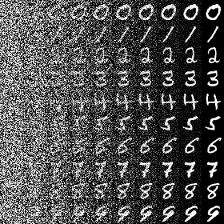

# Modular Diffusion

Welcome to Modular Diffusion! This package provides an easy-to-use and extendable API to train generative diffusion models from scratch. It is designed with flexibility and modularity in mind, allowing you to quickly build your own diffusion models by plugging in different components.

> **Warning**: The code for Modular Diffusion is not yet available on PyPI, as it is still undergoing significant development. A stable release will be published there once the code base, unit tests, and documentation reach a satisfactory state of completion. Stay tuned for more updates, and thank you for your patience!

## Features
- ⚙️ **Highly Modular Design**: Tailor and build your own diffusion models by leveraging our flexible `Model` class. This class allows you to choose and implement various components of the diffusion process such as noise type, schedule type, denoising network, and loss function.
- 📚 **Growing Library of Pre-built Modules**: Get started right away with our comprehensive selection of pre-built modules.
- 🔨 **Custom Module Creation Made Easy**: Craft your own unique modules with ease. Just inherit from the base class of your chosen module type and get creative!
- 🤝 **Seamless Integration with PyTorch**: This project harmoniously integrates with PyTorch, allowing users to leverage the plethora of features and community support the framework has to offer.
- 🌈 **Broad Range of Applications**: From generating high-quality images to implementing non-autoregressive audio and text synthesis pipelines, the potential uses of Modular Diffusion are vast.

## Usage

With Modular Diffusion, you can build and train a custom Diffusion Model in just a few lines:

1. Load and normalize your dataset. We are using [MNIST](http://yann.lecun.com/exdb/mnist/).

   ```python
   x, y = zip(*MNIST(str(input), transform=ToTensor(), download=True))
   x, y = torch.stack(x) * 2 - 1, torch.tensor(y) + 1
   ```

2. Build your custom model using Modular Diffusion's prebuilt modules ([or create your own!](https://cabralpinto.github.io/modular-diffusion/guides/custom-modules/)).

   ```python
   model = diffusion.Model(
       data=Identity(x, y, batch=128, shuffle=True),
       schedule=Cosine(steps=1000),
       noise=Gaussian(parameter="epsilon", variance="fixed"),
       net=UNet(channels=(1, 64, 128, 256), labels=10),
       guidance=ClassifierFree(dropout=0.1, strength=2),
       loss=Simple(parameter="epsilon"),
   )
   ```

3. Train and sample from the model.

   ```python
   losses = [*model.train(epochs=10)]
   z = model.sample(torch.arange(10))
   z = z[torch.linspace(0, z.shape[0] - 1, 10).long()]
   z = rearrange(z, "t b c h w -> c (b h) (t w)")
   save_image((z + 1) / 2, "output.png")
   ```

 4. Marvel at the results.

    


Check out the [examples](examples) folder in our repository for more examples and refer to our [documentation](https://cabralpinto.github.io/modular-diffusion/guides/getting-started/) for more information.

## Installation

Modular Diffusion officially supports Python 3.10+ and is available on PyPI:

```bash
pip install modular-diffusion
```

> **Note**: Although Modular Diffusion works with later Python versions, we highly recommend using Python 3.10. This is because `torch.compile`, which significantly improves the speed of the models, is not currently available for versions above Python 3.10.

## Contributing

Contributions to this project are very much welcome! Feel free to raise issues or submit pull requests here on GitHub.

## License

This project is licensed under the [MIT License](LICENSE).

## Citation

If you use this library in your work, please cite it using the following BibTeX entry:

```bibtex
@misc{ModularDiffusion,
  author = {João Cabral Pinto},
  title = {Modular Diffusion},
  year = {2023},
  publisher = {GitHub},
  howpublished = {\url{https://github.com/cabralpinto/modular-diffusion}},
}
```
